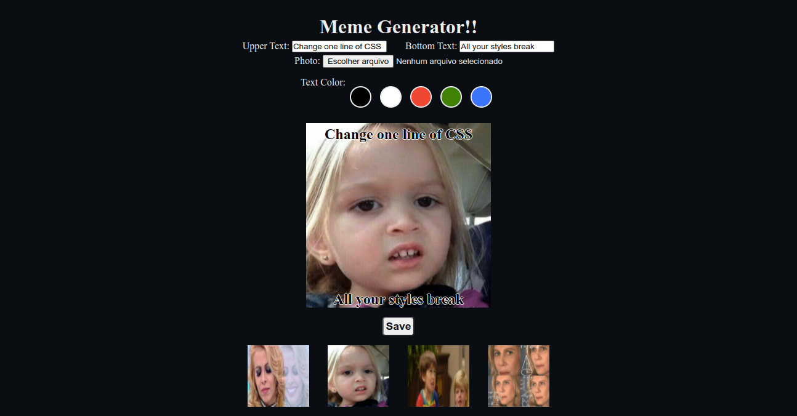

# Meme Generator Project
  
  

  
<h2>:brazil: Português</h2>

 Esse projeto foi desenvolvido enquanto estudava Fundamentos do Desenvolvimento Web no curso da Trybe. 

## Live Link
<a target="_blank" href="https://memefyit.netlify.app">Meme Generator</a>
  
  ## Screenshot
 
  
  ## Objetivos
  * Criar um gerador de meme;
  * Oferecer a possibilidade do uso de imagens pré-carregadas para memes;
  * Oferecer a possibilidade da inserção de textos no topo e na base da imagem do meme;
  * Oferecer a possibilidade de realizar o upload de uma imagem e fazer o meme através dessa imagem;
  * Oferecer a possibilidade de realizar o download do meme após concluido.
  
  ## Tecnologias Utilizadas
  * HTML
  * CSS
  * Javacript
  * DOM
  * Semantic HTML
  
  
  ## Como usar
  Acesse a página, selecione a imagem base do meme, ou faça o upload do seu aparelho, escolha a cor do texto, preencha os textos e faça o download do seu meme pronto.  
  Disclaimer: 
   
     O criador desse projeto não responsabiliza pelo uso da imagem;  
      Todas as imagens são reproduzidas de: 
        * https://museudememes.com.br/collection/nazare-confusa 
        * https://museudememes.com.br/collection/chloe-sincera 
        * https://museudememes.com.br/collection/por-que-voce-nao-amadurece 
        * https://museudememes.com.br/collection/nazare-confusa 

  ## Informações de Desenvolvimento
  Commits de Desenvolvimento: 16;  
  Tempo Gasto: 3 days; 

This project was done while studying Fundamentals of Web Development in the Trybe course. 
 
 Interesting points:
 * Upload image mechanism;
 * Meme preparation;
 * Download mechanism of the finished meme.

## Live Link
<a target="_blank" href="https://memefyit.netlify.app">Meme Generator</a>
  
## Screenshot

## My Goals
* Create a meme generator;
* Offer some pre-made images for memes;
* Place text on the top and bottom of meme image;
* Possibility to upload one image and make an meme of it;
* Possibility to download the finished meme.

## Used Technologies
  * HTML
  * CSS
  * Javacript
  * DOM
  * Semantic HTML

## How to use it
  Just go to the page, select the meme image or upload it from your device, select the color of the text, type the top and bottom text and download it.  
  Disclaimer: 
   
     The creator of this project shall not be liable for uploaded images;  
      All Images provided where reproduction from: 
        * https://museudememes.com.br/collection/nazare-confusa 
        * https://museudememes.com.br/collection/chloe-sincera 
        * https://museudememes.com.br/collection/por-que-voce-nao-amadurece 
        * https://museudememes.com.br/collection/nazare-confusa 
    
    
## Development Information
  Development Commits: 16;  
  Time Spent: 3 days;   
